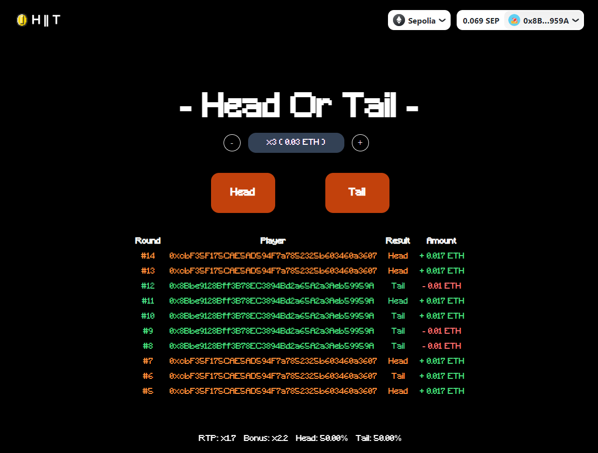

# Head or Tail Betting Game

## Introduction

The Head or Tail Betting Game is a decentralized application (DApp) built on the `Sepolia testnet`, a blockchain platform, that allows users to place bets on the outcome of a coin toss. The game utilizes a smart contract to ensure fairness and transparency.

## How it Works

1. **Smart Contract Deployment**

   - The smart contract for the game is deployed on the Sepolia testnet.
   - The contract holds the game logic, manages the betting process, and includes the odds and bonus calculations.

2. **Placing Bets**

   - Users interact with the DApp's frontend on the Sepolia testnet to place their bets.
   - Each user can choose to bet on either "Head" or "Tail" for the coin toss outcome.
   - Users specify the amount of cryptocurrency they want to bet.

3. **Coin Toss**

   - Once all bets are placed, the game triggers a coin toss.
   - The coin toss is performed using a random number generation mechanism.
   - The outcome is determined as either "Head" or "Tail".

4. **Determining Winners and Losers**

   - The smart contract compares the coin toss outcome with each user's bet.
   - Users who guessed correctly are declared winners.
   - The smart contract calculates the winnings for each winner based on the total bet amount, the odds, and the chance of getting a bonus.

5. **Calculating Winnings**

   - For winners, the smart contract calculates the standard winnings by multiplying their bet amount by the odds of 1.7x.
   - Additionally, there is a chance for winners to receive a bonus of 2.2x on their winnings.
   - The smart contract uses a random number generation mechanism to determine if a bonus is awarded.
   - The contract automatically calculates the final winnings, including any bonuses, for each winner.

6. **Automatic Payout**

   - The smart contract on the Sepolia testnet automatically transfers the winnings, including any bonus amounts, to the winners' wallet addresses.
   - Winners do not need to claim their winnings manually, as the smart contract handles the payout process.

7. **Changing RTP (Return to Player)**

   - Only the contract owner has the ability to change the RTP (Return to Player) for the game.
   - The RTP determines the overall percentage of bets that will be returned to the players as winnings over time.
   - The contract owner can adjust the RTP as needed to maintain a fair and balanced gameplay experience.

8. **Game Reset**

   - After the game is concluded, the smart contract on the Sepolia testnet resets the game state for the next round.
   - Users can participate in subsequent rounds by placing new bets.

## Advantages of Smart Contract

- **Transparency**: The smart contract ensures transparency by providing a verifiable and auditable record of all bets, outcomes, odds, and bonuses.
- **Security**: The use of blockchain technology and smart contracts on the Sepolia testnet eliminates the need for trust in a centralized authority, reducing the risk of fraud or manipulation.
- **Automated Payouts**: The smart contract on the Sepolia testnet automatically calculates and distributes the winnings, including bonuses, to the winners, eliminating the need for manual intervention or claiming by the players.
- **Immutable Rules**: The game rules defined in the smart contract on the Sepolia testnet cannot be changed, ensuring a fair and consistent gameplay experience.

## Conclusion

The Head or Tail Betting Game is an innovative DApp that leverages the power of blockchain and smart contracts on the Sepolia testnet to provide a transparent and secure betting experience. By incorporating
